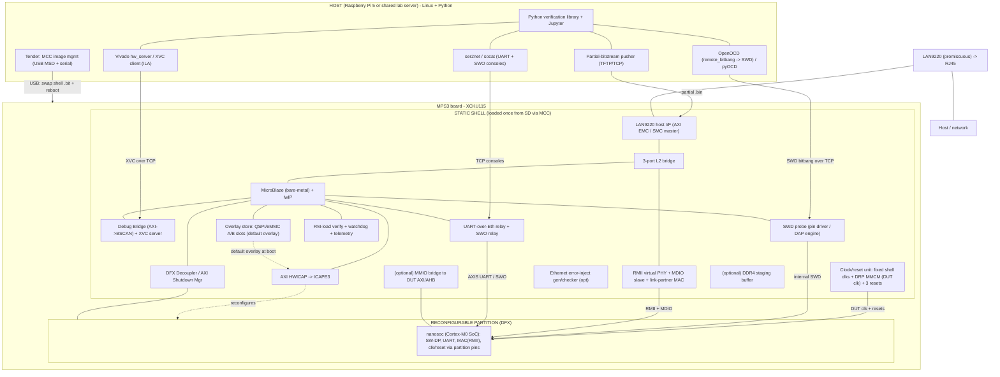
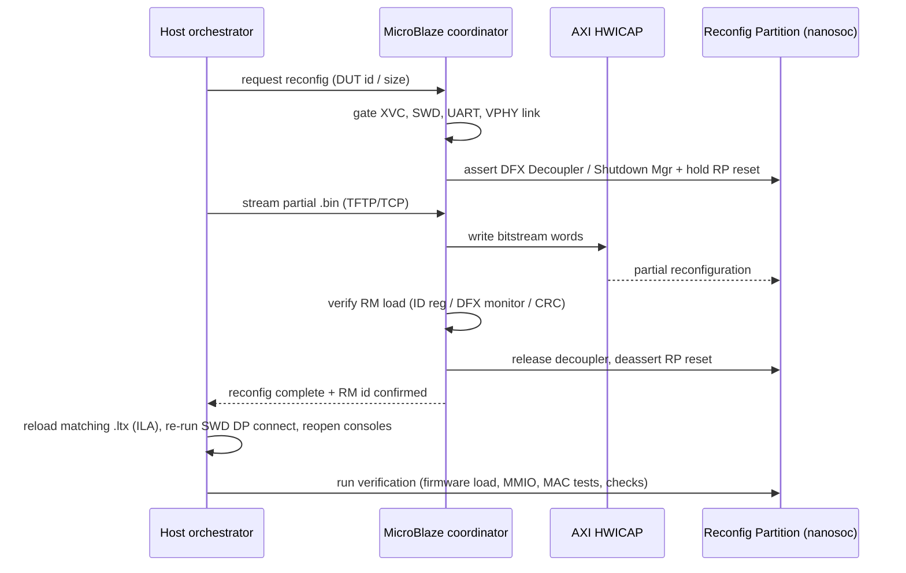

# MPS3 nanoSoC Verification Platform — Architecture & Implementation Spec

> **Status: HISTORICAL** — a record of the v2.1 platform architecture & implementation spec (the design as agreed before implementation) as of 2026-07-10.
> Superseded by / current state in [docs/ARCHITECTURE.md](ARCHITECTURE.md) and [docs/STATUS.md](STATUS.md).
> Kept for provenance; do not update.

**Version:** 2.1
**Status:** Design agreed, ready for implementation
**Audience:** Implementation (code) agent + FPGA/firmware engineers
**Target platform:** Arm MPS3 FPGA Prototyping Board (Xilinx Kintex UltraScale XCKU115)
**Device under test (DUT):** SoC Labs *nanosoc* (Arm Cortex-M0 CMSDK-based SoC)

### Revision history
- **v2.1** — Added **overlay persistence & default-overlay mechanism** (§8A): two-tier persistence (shell in MCC config store; default overlay in shell-owned QSPI/eMMC/µSD), greybox-initial + boot-time NVM load, A/B golden-slot networked commit; matching roadmap phase, repo entries, and decisions (D13/D14).
- **v2.0** — Added clocking/reset architecture (configurable DUT clock, three-reset scheme); the RMII virtual-PHY + LAN9220 MAC-in-operation verification subsystem; full open-source reuse inventory with licenses; **UART-over-Ethernet** service; **bridge/switch options** section; SWD-over-Ethernet and SWO-over-Ethernet debug planes; additional platform features (RM-load verification, watchdog, telemetry, golden image).
- **v1.0** — Core "disaggregated PYNQ" architecture: static shell + DFX partial reconfiguration over Ethernet, MicroBlaze config agent, ILA-over-XVC, phased roadmap.

---

## 1. Purpose & goals

Build a **networked, Python-driven verification/development platform** for Arm Cortex-M SoC designs, running on existing MPS3 boards, with a **fast edit→load→test loop**.

The core problem being solved: the MPS3's native configuration path (the MCC reloads the whole FPGA from SD and reboots the board) costs *minutes* per DUT change. We remove that from the inner loop by loading a **persistent "shell"** once, then swapping the DUT via **partial reconfiguration (DFX) delivered over Ethernet** in *sub-second to seconds*.

### Goals
- Persistent shell on the FPGA that boots automatically from SD and brings up Ethernet without host intervention.
- Deploy DUT partial bitstreams (`.bin`) over Ethernet — no reboot, no JTAG cable in the routine loop.
- Networked, scriptable verification in Python (the "PYNQ experience" without a hard PS).
- Processor debug (SWD), fabric debug (ILA), trace (SWO), and the DUT console (UART) all available **over Ethernet**.
- Verify the DUT's own Ethernet MAC **in operation** as a black box, driven at RMII, reachable over the board's LAN9220.
- Reuse existing Arm / SoC Labs / Xilinx IP and open-source firmware/gateware wherever possible.

### Non-goals (explicitly out of scope for v1)
- Running Linux/PYNQ on a soft core in the fabric. **Do not** attempt a MicroBlaze-Linux/PYNQ port. The Python/Linux "brain" lives on an external host. (Note: the MicroBlaze here is a **bare-metal** agent — that is fine and expected.)
- High-throughput reconfiguration or high-throughput DUT networking (the LAN9220 is 10/100; it is the bottleneck — see §7, §9).
- Cycle-accurate RTL functional verification. That stays in the existing cocotb/simulation flow; this platform is for software/integration bring-up, register/peripheral testing, and MAC-in-operation testing.

---

## 2. Design principle: "Disaggregated PYNQ"

PYNQ bundles (Ubuntu + Jupyter + Python) + (bitstream loading) + (memory-mapped access to the DUT), hosted on a hard Cortex-A PS. The XCKU115 has **no hard PS**. Instead of recreating the PS in soft logic, we **split the responsibilities**:

| PYNQ concept | Where it lives here |
|---|---|
| Linux + Python + Jupyter (the "brain") | External **host** (Raspberry Pi 5 or shared lab server) |
| Bitstream / overlay loading | Host → Ethernet → **on-FPGA config agent** (ICAP); MCC only for shell rebuilds |
| Memory-mapped access to DUT | SWD + optional MMIO bridge, tunnelled over Ethernet |

The host is the Cortex-A replacement; the fabric holds only the shell + DUT.

---

## 3. Hardware context (fixed facts to design against)

### MPS3 board
- **FPGA:** Xilinx Kintex UltraScale **XCKU115-1FLVB1760C** — a **2-SLR SSI device** (relevant to DFX floorplanning).
- **Memory:** 4 GB DDR4 SO-DIMM, 16 GB eMMC, 8 MB QSPI flash.
- **Ethernet:** **SMSC LAN9220** — a 10/100 controller with integrated MAC+PHY, on the FPGA **static memory interface** (memory-mapped register/FIFO host interface; not MII/RMII to fabric). Driver name: `smsc9220` / `smsc911x`. This single port carries **management + reconfig + debug + DUT uplink** traffic (see §9).
- **Config:** Motherboard Configuration Controller (**MCC**) loads the FPGA image from config mass storage at power-up. The store enumerates over USB as **`V2M_MPS3`**; images are selected via `images.txt` under `MB/HBI0309C/<AN>/`. A `reboot` command over the MCC serial console re-triggers configuration. Monolithic and slow — used only for shell (re)builds.
- **USB debug port:** exposes the `V2M_MPS3` mass storage + several UART serial ports. **Not** a Vivado-attachable FPGA JTAG channel.
- **20-pin IDC header:** CoreSight **processor** debug (P-JTAG / SWD) to general-purpose FPGA pins — reaches the CPU's CoreSight DAP inside the image, **not** the Kintex fabric BSCAN/config TAP. Used only for first bring-up (§10).

### DUT: SoC Labs nanosoc
- Arm **Cortex-M0** microcontroller SoC built on Arm **CMSDK**; **AHB-Lite** interconnect, **APB** peripherals, Arm **DMAC**.
- **SoCDebug** debug manager + CoreSight DAP; UART is `cmsdk_apb_usrt` with **AXI-Stream** byte TX/RX (relevant to UART-over-Ethernet, §11).
- Built-in **AXI-Stream ⇆ FT1248** debug/test-injection path carrying **ADP** commands (used by SoC Labs cocotb bench and RP2040 test board).
- Existing **Xilinx FPGA target** + Zynq **PYNQ** target (ZCU104); we retarget the FPGA wrapper to XCKU115/MPS3.
- **Licensing dependency:** nanosoc pulls Cortex-M0 + CMSDK IP from Arm's AAA Product Download Hub (obfuscated RTL). Ensure entitlement before synthesis.

---

## 4. System architecture



### 4.1 Static shell (persistent, loaded once from SD)
Everything here must be **independent of the RP** — the DUT appearing/disappearing must never take down the network agent (enforced via the AXI Shutdown Manager). Contents:

| Block | Function | Source / IP (see §12 for reuse detail) |
|---|---|---|
| Clock/reset unit | Fixed shell clocks + DRP-reconfigurable DUT clock + 3 resets | Xilinx MMCM/Clocking Wizard + custom (§5) |
| Board wrapper | Clock/reset from MPS3 SCC/MCC; XCKU115 pinout | Adapt nanosoc Xilinx target + Arm MPS3 SMM wrapper |
| LAN9220 host I/F | AXI ⇄ LAN9220 register/FIFO over static memory bus | Xilinx AXI EMC (or small SMC master) + ported driver |
| 3-port L2 bridge | Route management / DUT-MAC / LAN9220 uplink | Crossbar + parse + small forwarding (§8) |
| MicroBlaze (bare-metal) + lwIP | Config + debug + console agent | Xilinx MicroBlaze; lwIP |
| AXI HWICAP → ICAPE3 | Partial-bitstream delivery | Xilinx AXI HWICAP |
| DFX Decoupler + AXI Shutdown Manager | Isolate RP during reconfig | Xilinx DFX IP |
| Debug Bridge (`From_AXI_to_BSCAN`) + XVC server | ILA/VIO over Ethernet | Xilinx Debug Bridge + xvcServer on MicroBlaze |
| SWD probe | Drive internal SWD into nanosoc SW-DP | Custom (v1 pin-wiggler; v2 CMSIS-DAP engine) |
| RMII virtual PHY + link-partner MAC | MAC-in-operation verification (§8) | LiteEth RMII + MDIO slave + custom |
| Error-inject gen/checker | Malformed-frame stimulus + TX checking (opt) | cocotbext-eth (sim) / custom HW |
| UART-over-Eth + SWO relay | DUT console + trace over TCP (§11) | Custom relay on MicroBlaze + host ser2net |
| RM-load verify / watchdog / telemetry | Robustness on a shared farm (§13) | DFX Bitstream Monitor + custom + INA228 |
| Overlay store | Persist + boot-load the default overlay (§8A) | AXI Quad SPI (QSPI) / SD-MMC + FatFs (eMMC/µSD) |
| (optional) MMIO bridge | Host register R/W into DUT over Ethernet | Custom AXI master relayed by MicroBlaze |
| (optional) DDR4 staging buffer | Buffer partial before ICAP; fast path | Xilinx MIG + AXI CDMA (v2) |

### 4.2 Reconfigurable Partition (RP)
- Holds **nanosoc** (or DUT variant). Swapped by partial bitstream over Ethernet.
- Partition pins to the shell: SWD, RMII + MDIO, UART/SWO AXI-Stream, DUT clock(s), the 3 resets, optional MMIO/AXI, optional ADP/FT1248 stream, optional RM ILA debug.
- Floorplan sized for the **largest** anticipated DUT; keep **within a single SLR** to start.

### 4.3 Host (Pi 5 or shared server)
- **Tender:** mounts `V2M_MPS3` over USB, writes shell `.bit` + `images.txt`, issues MCC `reboot`. Only for shell (re)builds.
- **Partial pusher:** sends DUT `.bin` (TFTP or raw TCP — D3).
- **OpenOCD / pyOCD:** SWD to the on-chip probe.
- **XVC client:** Vivado hw_server / "Add Xilinx Virtual Cable" → ILA.
- **ser2net / socat:** present the DUT UART/SWO TCP streams as local pseudo-ttys.
- **Python library + Jupyter:** verification API + interactive front-end.
- **Orchestrator:** sequences load → re-attach → test.

**Topology (D1):** one Pi per board, or one Linux server driving many MPS3s via USB hubs (recommended for a farm).

---

## 5. Clocking & reset architecture

### Clocking
- Generate **all DUT clocks in the static shell** from an MMCM/PLL and route them into the RP via partition pins. **Do not** put clock generators inside the RM (complicates DFX and loses runtime control).
- Make the DUT-clock MMCM **DRP-reconfigurable** so the MicroBlaze/host can change the DUT frequency at runtime (sweep frequency, run at silicon rate, or drop low for debugging). Expose a "set DUT clock" register.
- Fixed shell clocks: AXI/MicroBlaze (~100 MHz), ICAP clock (~100 MHz), the LAN9220 static-memory-bus timing, and the **50 MHz RMII reference** (shell acts as PHY and sources it — §8).
- **CDC everywhere the static and DUT domains meet** (AXI clock-converter IP on buses, `axis_async_fifo` on streams, reset synchronizers). Keep the debug hub / ILA on an always-on static clock so debug survives whatever the DUT clock is doing.

### Reset (three distinct, all shell-driven)
1. **DUT system reset** — host-controllable via a MicroBlaze register, to nanosoc through a partition pin. Core verification primitive (reset between tests, emulate power-on).
2. **Reconfiguration reset** — owned by the coordinator; holds the RM in reset during/after a partial load (with `RESET_AFTER_RECONFIG` + the decoupler).
3. **Debug reset (SRST)** — map OpenOCD's srst (`r/s/t/u` from the SWD path) onto the DUT reset so the debugger can reset the core.

Generate all three static-side; **assert asynchronously, deassert synchronized** to the destination domain (reset synchronizer per domain).

---

## 6. Control flows

### 6.1 Cold bring-up (per power cycle / shell change)
1. Host tender writes shell `.bit` + `images.txt` to `V2M_MPS3`; issues MCC `reboot`.
2. MCC configures XCKU115 from SD → static shell comes up (RP holds a **greybox** RM, inert).
3. MicroBlaze boots, lwIP up, LAN9220 up (via the bridge), static IP/DHCP; services listening.
4. MicroBlaze loads the **default overlay** from shell-owned NVM into the RP via ICAP (§8A) — board self-boots to a working default DUT, no host needed.
5. Host confirms reachability.

### 6.2 DUT swap (inner loop — the fast path)


### 6.3 Debug/console re-attach after a swap
- **ILA:** XVC can't detect the swap; host refreshes the target and loads the **new RM's `.ltx`**.
- **SWD:** DP rebuilt → host re-runs SWD line reset + DP connect (read DPIDR). DUT must be clocked and out of reset.
- **UART/SWO:** streams re-establish; host reconnects TCP consoles.
- **MAC/VPHY:** virtual PHY re-asserts link-up; re-run any DUT-side PHY bring-up.

---

## 7. Partial reconfiguration path

- **Primary (v1):** MicroBlaze → **AXI HWICAP** → **ICAPE3**. HWICAP is AXI4-Lite, single-word (~2.5 MB/s), well-matched to the 10/100 link — the network, not ICAP, is the limiter. Swap time: sub-second to a few seconds vs minutes for MCC+reboot.
- **Fast path (v2, only if needed):** stage `.bin` into **DDR4** over Ethernet, then **DDR → ICAP** via **AXI CDMA + HBICAP** (hundreds of MB/s class). Only worthwhile with a faster NIC than the LAN9220.
- **Bitstream generation:** Vivado **DFX flow** — per-RM implementation runs, `RESET_AFTER_RECONFIG`, `.bit`→`.bin` for ICAP delivery (correct bit ordering).
- **Decoupling is mandatory** on UltraScale: decouple/quiesce before load, hold RP reset through STARTUP, release after.
- **RM-load verification:** confirm the right/complete RM loaded via a DUT-side ID register readback and/or the **DFX Bitstream Monitor** IP + config CRC (§13).

---

## 8. Ethernet MAC-in-operation verification subsystem

The DUT's Ethernet MAC is **verified in operation as a black box**: driven through its real RMII interface, with the shell acting as the link partner. Because the MAC is the thing under test, we do **not** tap frames above it — we terminate at RMII and provide a fabric-side "virtual PHY."

### 8.1 Components
- **RMII datapath crossover (`rmii_phy_if`)** — PHY-side interface: sources the 50 MHz REF_CLK to the DUT, drives RXD/CRS_DV, samples TXD/TX_EN; converts RMII (2-bit @ 50 MHz) ↔ MII/internal for the link-partner MAC. Handle CRS_DV (multiplexed carrier-sense/RX-valid) timing.
- **Virtual PHY / MDIO slave** — a synthesizable MDIO (MDC/MDIO) slave presenting a plausible PHY ID and BMCR/BMSR/ANAR/ANLPAR reporting link-up, 100/full. **Critical:** without it the DUT's PHY bring-up/auto-neg poll hangs. MicroBlaze-writable so the host can inject link events (up/down, speed) to test the DUT's link handling.
- **Link-partner MAC** — a fabric MAC recovering DUT frames as AXI-Stream, feeding the bridge.
- **Error-inject traffic gen/checker (recommended)** — inject known-good and **malformed** frames (bad FCS, runts, giants, IFG violations, dribble), and independently check the DUT MAC's TX framing/CRC and RX behaviour. This is what makes it MAC *verification* rather than "it pings."

### 8.2 Datapath
DUT MAC (RP) ⇄ RMII + MDIO (partition pins) ⇄ virtual PHY + `rmii_phy_if` ⇄ link-partner MAC ⇄ `eth_axis_rx`/`tx` ⇄ **3-port bridge** ⇄ CDC ⇄ LAN9220 host I/F ⇄ LAN9220 (promiscuous) ⇄ RJ45 ⇄ host/network. The MicroBlaze/lwIP management stack is the bridge's third port.

### 8.3 Clocking / gotchas
- Shell sources the 50 MHz RMII reference (configure the DUT MAC for ref-**in**); don't let both source it.
- LAN9220 must be **promiscuous** to carry the DUT's MAC address; it's 10/100 and shared, so this is functional testing, not throughput benchmarking.
- Keep the whole link partner + virtual PHY in the **static shell**, behind the Shutdown Manager, so it persists across DUT swaps and a broken DUT MAC can't wedge the tester. Only RMII + MDIO cross the partition boundary.
- Two MACs (DUT + management) behind one physical port is normal Ethernet; the upstream switch learns both.

### 8.4 Two-sided verification note
"Black box" here means: exercise the MAC through RMII + its software-visible registers (host reads/writes via SWD/MMIO, checks DMA descriptors/IRQs — nanosoc's DMAC is in play), **and** have the on-chip peer independently score frames. The programmable link partner gives you both.

---

## 8A. Overlay persistence & default-overlay mechanism

Goal: the board self-boots to a **known default DUT** with no host, and that default can be **changed over Ethernet and persisted** so it survives a power cycle. The MPS3 makes this clean because it has FPGA-accessible non-volatile memory that is *separate* from the MCC's config store.

### 8A.1 Two persistence paths on the board
- **MCC config store** — the SD/config memory the MCC reads to configure the FPGA, exposed over USB as `V2M_MPS3`. Holds the shell `.bit` + `images.txt`. **Written by the host over USB** (the tender), not by the FPGA. The MCC can also load `elf/hex/bin` files to system-memory addresses at boot (≤32 images) and has `DEPOSIT`/`EXAM` word access.
- **User NVM, FPGA-accessible** — 8 MB QSPI flash (SST26VF064B), 16 GB eMMC, and a microSD interface, all reachable by the FPGA design (per the MPS3 TRM §2.15; QSPI is the typical boot memory). The MicroBlaze can **read and write** QSPI via an AXI Quad SPI core, and eMMC/µSD via an SD/MMC host core.

The second path is what lets the shell own and rewrite its own default overlay over Ethernet, with no USB round-trip.

### 8A.2 Two-tier persistence model
Split persistence by change frequency:
- **Shell image → MCC config store**, updated by the host over USB (the existing tender). Changes rarely.
- **Default overlay → shell-owned NVM** (QSPI for a single default; eMMC/µSD for a library), updated over Ethernet by the MicroBlaze. Changes often.

### 8A.3 Boot-time default load
1. MCC loads the static shell `.bit`; the RP comes up holding a **greybox RM** (RP defined but tied-off — legal fabric, does nothing).
2. The MicroBlaze reads the **default overlay** from its NVM slot, applies the decoupling handshake, and streams it to AXI HWICAP → ICAP. Board self-boots to a working default DUT.

> Alternative (simpler, less flexible): bake the *real* default RM into the shell bitstream instead of a greybox — DUT present instantly, but changing the default then needs a full shell rebuild. The greybox-plus-NVM route is what makes the default changeable; it is the recommended default (D14).

### 8A.4 Change + commit (fully networked)
1. Host streams a new overlay over Ethernet → MicroBlaze runs it via ICAP (volatile "try it").
2. Host sends `commit`; MicroBlaze writes the overlay into the NVM default slot + updates the metadata header.
3. Next power-cycle → MicroBlaze boots that overlay as the default. No USB, no MCC.

### 8A.5 Safe update (A/B golden slots)
Manage the store with a small header + **two slots**: `{magic, version, active_slot, per-slot:{id, size, CRC, valid}}`. `commit` writes the new overlay to the **inactive** slot, verifies CRC, then flips `active_slot`. An interrupted/failed write cannot brick the default — it falls back to the last-good slot. This is the overlay-level counterpart of the golden-image feature (§13), and the same CRC/ID doubles as RM-load verification (§7).

### 8A.6 Storage choice (D13)
- **QSPI (8 MB)** — simplest: raw A/B slots, no filesystem; fits a small Cortex-M0 RP partial (hundreds of KB–~2 MB) + metadata. Mind the SST26VF064B **block-protection registers** when writing. *Recommended for v1.*
- **eMMC / µSD (GBs)** — FatFs on the MicroBlaze over an SD/MMC host core; overlays become files and "default" is a pointer entry (a shell-owned `images.txt` equivalent) holding a whole overlay library. *Recommended once >1 stored DUT is wanted.*

### 8A.7 "Written to the SD card" — which SD?
Confirm on the actual board whether the **user microSD** (FPGA-accessible, §2.15) and the **MCC config SD** (`V2M_MPS3`) are the same physical card or two separate interfaces:
- *User microSD FPGA-wired* → MicroBlaze writes it directly (SD host core) → fully-networked commit.
- *Only the MCC config SD* → SD writes go through the **host over USB**: host writes the new `.bin` + updates `images.txt`; at next boot the MCC either loads it into shell staging RAM (needs the shell to implement the **MCC-SMC memory interface**) or the default is baked in. Reuses the tender but is not a pure-network commit.

QSPI/eMMC are unambiguously FPGA-accessible either way, so **anchor the default-overlay store on QSPI (v1) / eMMC (v2)** and treat the MCC-SD path as the host-side complement already used for shell images.

---

## 9. Bridge / switch options

The bridge's job is small: route three fixed ports — **management** (MicroBlaze/lwIP), **DUT MAC**, **LAN9220 uplink** — with a known, tiny set of MAC addresses. This is a **3-port bridge**, not a general learning switch, and that scope should drive the choice.

| Option | Type / license | Fit for this project |
|---|---|---|
| **Forencich `axis_switch` + `eth_axis_rx` + small forwarding** (verilog-axis / verilog-ethernet, MIT) | Free crossbar + parse, assemble-your-own | **Recommended.** Smallest, cleanest, fully in your control |
| **Xilinx AXI4-Stream Switch** LogiCORE | Free crossbar (routes by `TDEST`, not L2) | Equivalent to above using the Xilinx crossbar; pair with dest-MAC→`TDEST` map |
| **Private Island** soft Ethernet switch | Open project (check license) | Good *reference* for RX classify/filter path; a whole project, not a drop-in core |
| **LiteX / LiteEth** ecosystem | BSD-2, actively maintained | Best-supported open option if you want more than a hand-rolled bridge; verify the current switch/crossbar module |
| **AMD 100M/1G TSN Subsystem** (3-port switch) | Licensed AMD IP | **Overkill** — TSN-focused (MCDMA/PTP/Qbv/VLAN), 1G/RGMII-oriented. Only if verifying TSN features becomes a goal |
| **SoC-E TGES** (managed L2/TSN, up to 32 ports) | Commercial | Turnkey managed switch; far more than needed |
| **CAST TSN-SE** (switched endpoint, Verilog RTL) | Commercial | Turnkey switched endpoint; far more than needed |

**Decision (D9):** build the 3-port bridge on a free crossbar (Forencich or Xilinx AXIS Switch) + `eth_axis_rx` for the dest-MAC parse + a handful-of-entries forwarding table (or flood on miss). Reserve a full switch core (open Private Island/LiteX, or commercial SoC-E/CAST, or AMD TSN) only if port count or features (learning, VLANs, STP, TSN) grow beyond a hand-rolled bridge.

---

## 10. Debug architecture — planes (all over Ethernet)

| Plane | Mechanism | Transport | Use |
|---|---|---|---|
| **Fabric / hardware** | ILA/VIO + Debug Bridge (`From_AXI_to_BSCAN`) + XVC | Ethernet | Signals; boundary-bus transactions |
| **Processor / software** | nanosoc Cortex-M0 via SWD (§10.1) or SoCDebug/ADP | Ethernet | Firmware load, halt/step, breakpoints, MMIO |
| **Trace** | Cortex-M SWO/ITM relayed like UART (§11) | Ethernet | Software observability |
| **First bring-up only** | CoreSight probe on 20-pin header | Physical | Before the networked stack exists to bootstrap from |

**ILA placement (D4):** *static ILAs* on the static↔RP boundary bus (stable across swaps, no per-partial `.ltx` churn — recommended default) vs *RM ILAs* inside the partial (deeper view; each RM needs a `From_BSCAN_to_Debug` Debug Bridge, its own `.ltx`, and a host re-scan after every swap). ILA BRAM competes with DUT BRAM; XVC can't detect overlay replacement → gate during reconfig.

*Decided 2026-09-23 (the project lead): RM-internal ILAs, reversing "static boundary for v1".* A static-side ILA/VIO is now **forbidden**: Vivado would attach it to the RM's debug hub through new RP ports. Instead the partition boundary gains a 12-wire BSCAN group `dbgbscan` (11 shell-driven legs + `dbg_bscan_tdo`; 47 ports / 148 bits / 20 decoupler INTFs, from 35 / 136 / 19), so the static `debug_bridge_0` (`C_DEBUG_MODE=2`, `C_NUM_BS_MASTER=1`) reaches a mode-1 `debug_bridge` inside the RM and that RM's ILAs over XVC (TCP 2542). Each debug RM ships a per-RM partial `.ltx` (`config_<rm>.ltx`) carried in the overlay manifest as `ltx`. A swap invalidates the XVC session: close the target before the swap, reopen it and reload the new `.ltx` after. Designed and bench/synthesis-proven; first carried by the next mint (the 2026-10 ILA mint), not on silicon yet. Detail: `docs/planning/HANDOVER_RM_ILA_OVER_XVC.md`, `docs/contracts/partition-pins.md`.

### 10.1 SWD over Ethernet
- **v1 — dumb pin-wiggler (implement first):** host OpenOCD `adapter driver remote_bitbang` + `transport select swd`; OpenOCD owns all SWD logic and ships pin-level commands; the MicroBlaze just sets/samples internal signals. **Requires OpenOCD ≥ the Jan-2021 SWD-in-remote_bitbang merge**; match the protocol chars exactly:
  ```
  O SWDIO drive   o SWDIO release   c sample SWDIO
  d {CLK0,DIO0}   e {CLK0,DIO1}     f {CLK1,DIO0}   g {CLK1,DIO1}
  B/b LED   r/s/t/u trst/srst   Q quit
  ```
  (Confirm CLK/DIO order vs `swd_write()` in your `bitbang.c`.) Internal wiring: `SWCLK`→`SWCLKTCK`; `SWDIO` split `swdio_o`/`swdio_i`/`swdio_oe` ↔ `SWDIOTMS`(+OE). Reference server: Glasgow `jtag-openocd` applet.
- **v2 — smart DAP engine (if v1 too slow):** port CMSIS-DAP `SW_DP.c`/`DAP.c` (or free-dap / LibSWD) onto the MicroBlaze via a `DAP_config.h` pin mapping; expose over Ethernet with a **custom pyOCD probe plugin** (DAP transactions over TCP) — CMSIS-DAP's native USB transport can't be pulled off the MPS3, so don't tunnel USB.

> The Arm IP library provides only the **target-side** DP/DAP (nanosoc has it). There is no synthesizable SWD-master ("probe") RTL from Arm — the host side is CMSIS-DAP *firmware*. Probe-side reuse (CMSIS-DAP/free-dap/LibSWD) is permissive and independent of the Arm IP license.

---

## 11. UART-over-Ethernet (and SWO)

Expose the DUT's console(s) over the network so the host sees the Cortex-M `printf` output (and, optionally, SWO trace) with no serial cable — reusing the same Ethernet link as everything else.

### FPGA side
- nanosoc's UART is `cmsdk_apb_usrt` with **AXI-Stream byte TX/RX**, so tap that stream at the partition boundary and have the MicroBlaze/lwIP relay it to/from a **TCP socket** (one port per UART). If a DUT exposes a raw serial line instead, add a small UART-to-AXIS shim first.
- **SWO/ITM trace:** route the Cortex-M SWO out to the shell and relay it identically (its own TCP port). Optionally decode ITM in the relay or leave raw for host-side tooling.
- Keep the relay in the static shell so consoles survive DUT swaps (streams simply re-establish).

### Host side
- Present each TCP stream as a local pseudo-tty with **ser2net** (RFC2217/telnet/raw), **socat**, or pyserial's `tcp_serial_redirect` — i.e. the "ser2eth or equivalent" role. Existing serial tools (minicom, picocom, pyserial-based test scripts) then attach to a normal `/dev/pts/*`.
- Raw TCP is the simplest transport; RFC2217 baud/line-control is largely moot since the DUT UART is delivered as AXI-Stream bytes, not a physical line. **Transport choice = D11** (raw TCP recommended).
- The Python verification library can also consume the console stream directly (assert on boot banners, scrape test output) without a pseudo-tty.

### Multiple consoles
nanosoc may have a boot-monitor UART plus an application UART — expose each on its own TCP port; the host maps them to separate ttys.

---

## 12. Reuse inventory (open source + vendor)

Of the Ethernet build items, only two need meaningful new RTL (the PHY register model, and the live error generator); the rest is reuse or assemble.

| Need | Reuse | License | Residual build |
|---|---|---|---|
| **RMII interface** | **LiteEth** `liteeth/phy/rmii.py` (RMII PHY: CRS_DV framing, speed-detect, CRG; emits Verilog) | BSD-2 | Flip MAC-side → PHY-side (small) |
| **Virtual PHY / MDIO** | MDIO slave: **freecores/sgmii** `mdio_slave.v`; **Lattice RD1194**. Sim PHY model: **cocotbext-eth** `MiiPhy` | OpenCores / Lattice ref / MIT | PHY **register model** (BMCR/BMSR/PHYID/ANAR) — small |
| **LAN9220 controller** | Fabric: **Xilinx AXI EMC** (or tiny SMC master). Driver: **Zephyr** `eth_smsc911x.c` (preferred), **Arm MPS3 SMM**, **Linux** `smsc911x` | Apache-2.0 / Arm / GPL | Port driver to bare-metal MicroBlaze (prefer Apache-2.0 Zephyr over GPL Linux) |
| **Bridge / switch** | See §9 — free crossbars (Forencich/Xilinx AXIS), Private Island / LiteX (open), SoC-E/CAST (commercial), AMD TSN (licensed) | MIT / BSD / commercial | 3-port forwarding glue (small) |
| **Error gen/checker** | Sim: **cocotbext-eth** (bad FCS/rx_er, PHY model). HW: **fpgadeveloper/ethernet-fmc-max-throughput** (HLS gen/checker w/ FCS error injection) | MIT / check | Small AXIS gen/checker for live injection |
| **Link-partner MAC / framing** | **verilog-ethernet** `eth_mac_mii`, `eth_axis_rx/tx`, `eth_arb_mux`; **verilog-axis** `axis_switch/fifo/async_fifo` | MIT | — |
| **SWD driving (v2)** | **CMSIS-DAP** `SW_DP.c`/`DAP.c`; **free-dap**; **LibSWD**; **DAPLink** | Apache-2.0 / BSD-3 | `DAP_config.h` pin map + TCP transport |
| **ICAP / DFX / debug IP** | Xilinx AXI HWICAP, DFX Decoupler, DFX AXI Shutdown Manager, Debug Bridge, DFX Bitstream Monitor, (HBICAP, CDMA) | Vivado IP | — |
| **Overlay store (NVM)** | QSPI: **Xilinx AXI Quad SPI** + driver. eMMC/µSD: soft SD/MMC host core + **FatFs** (ChaN, permissive). See §8A | Vivado IP / permissive | A/B-slot manager + commit logic (small); mind SST26VF064B block-protection |
| **Ethernet subsystem (board)** | Arm MPS3 SMM (Corstone SSE-300 **AN552**, Cortex-R52 **AN536**) — LAN9220 + `smsc9220` | Arm | — |
| **XVC / MicroBlaze-ICAP patterns** | Xilinx XVC wiki (XAPP1251-derived); Xilinx embedded-PR app note | Reference | — |
| **Bare-metal TCP/IP** | lwIP | Permissive | — |
| **Host UART bridge** | ser2net / socat / pyserial `tcp_serial_redirect` | Permissive | — |

**Landscape reference:** Fibich et al. (2023), *"Open-Source Ethernet MAC IP Cores for FPGAs: Overview and Evaluation"* — curated evaluation (synthesizability, CDC, MDIO quirks) of LiteEth, verilog-ethernet, P. Kerling's `ethernet_mac`, LMAC1/2/3, WGE100, OpenCores ethmac, NFMAC10G. Use when picking among MAC cores.

---

## 13. Additional platform features (robustness on a shared farm)

- **RM-load verification** — DUT-side ID register readback and/or DFX Bitstream Monitor + config CRC after every partial load; the coordinator reports the confirmed RM id to the host.
- **Watchdog + recovery** — shell watchdog that, with the AXI Shutdown Manager, recovers from a DUT that hangs the shared bus, without a full MCC reboot.
- **Power/current telemetry** — INA228-style monitor (as on the nanosoc test board) exposed over the network; turns the platform into a characterization rig.
- **Golden/recovery image** — a bad partial must not wedge the flow; keep an MCC fallback image.

---

## 14. Phased implementation roadmap

Each phase must be independently demonstrable.

1. **nanosoc on MPS3 (monolithic).** Retarget nanosoc's Xilinx target to XCKU115 + MPS3 wrapper; load via MCC. *Acceptance:* boots, UART prints.
2. **Static shell networking.** MicroBlaze + lwIP + LAN9220 host I/F + minimal bridge. *Acceptance:* board answers ping/echo; auto-boots from SD.
3. **Partial reconfiguration over Ethernet.** DFX with a trivial RM (LED counter) + AXI HWICAP + decoupler + config receiver + RM-load check. *Acceptance:* swap the RM over Ethernet twice without disturbing the shell/network.
3A. **Overlay persistence & default boot (§8A).** Greybox initial RM + AXI Quad SPI (QSPI) A/B slot store; boot-time load of the default overlay; networked `commit`. *Acceptance:* board self-boots to a default overlay from QSPI; a new overlay committed over Ethernet becomes the default after a power-cycle; interrupted commit falls back to the last-good slot.
4. **Clock/reset unit.** DRP DUT clock + 3-reset scheme + CDC on partition pins. *Acceptance:* set DUT clock and reset the DUT from a host register.
5. **nanosoc as the RM.** Wire partition pins (clocks, resets, SWD, RMII, UART). *Acceptance:* load nanosoc partial; it boots and prints via UART-over-Ethernet.
6. **UART-over-Ethernet.** Relay + host ser2net. *Acceptance:* DUT console over TCP; test script scrapes boot output.
7. **SWD over Ethernet (v1).** remote_bitbang pin-wiggler; host OpenOCD. *Acceptance:* GDB over Ethernet, read DPIDR, load firmware, breakpoint; re-attach after a swap.
8. **ILA over Ethernet.** Debug Bridge + XVC; RM-internal ILAs behind the BSCAN partition group (D4, revised 2026-09-23). *Acceptance:* Vivado XVC waveform; XVC session closed before a swap and reopened (new `.ltx`) after it.
9. **Ethernet MAC verification subsystem.** RMII virtual PHY + MDIO slave + link-partner MAC + LAN9220 bridge. *Acceptance:* DUT MAC links, exchanges frames with the host over LAN9220; error-injection cases (bad FCS/runt/giant) checked.
10. **Python verification layer + orchestration.** Library + Jupyter; orchestrate load→re-attach→test; port cocotb/ADP vectors. *Acceptance:* end-to-end "select DUT, load firmware, run test, check result" from a notebook.
11. **(optional) Performance + robustness.** DDR-stage+HBICAP; v2 batched SWD; MMIO bridge; watchdog; telemetry; golden image.

---

## 15. Open decisions / parameters

| ID | Decision | Default recommendation |
|---|---|---|
| D1 | Host topology: Pi-per-board vs shared server + USB hubs | Shared server (many boards) |
| D2 | nanosoc application-note / config target on MPS3 | (fill in from available deliverable) |
| D3 | Partial delivery transport: TFTP vs raw TCP | TFTP for v1 |
| D4 | ILA placement: static boundary vs RM-internal | ~~Static boundary for v1~~ → **RM-internal ILAs over XVC, decided 2026-09-23** (the project lead); static-side ILA/VIO forbidden; next mint (§10) |
| D5 | ICAP path: HWICAP vs DDR-stage+HBICAP | HWICAP for v1 |
| D6 | Processor debug primary: SWD vs SoCDebug/ADP | SWD; ADP for test-vector reuse |
| D7 | RP Pblock size (needs largest-DUT utilisation) | Measure nanosoc first |
| D8 | Network config: static IP vs DHCP | Site-dependent |
| D9 | Bridge: free crossbar vs open project vs commercial vs AMD TSN | Free crossbar (Forencich/Xilinx AXIS) + small forwarding |
| D10 | SWD: v1 pin-wiggler vs v2 CMSIS-DAP engine | v1 first; v2 if flash latency annoys |
| D11 | UART-over-Eth transport: raw TCP vs RFC2217 | Raw TCP |
| D12 | DUT-clock range + default frequency (DRP MMCM) | Set from nanosoc timing |
| D13 | Overlay store: QSPI vs eMMC/µSD vs MCC-config-SD | QSPI (v1); eMMC/µSD for a library |
| D14 | Default load: greybox + boot-load from NVM vs baked-in RM | Greybox + NVM (keeps default changeable) |
| D15 | Is the user microSD FPGA-wired, or only the MCC config SD? | **Confirm on board** — decides direct-write vs host-USB commit |
| D16 | QSPI overlay flash ↔ MCC arbitration, and the single-part collision: one 8 MiB SST26VF064B backs BOTH the DFX overlay store and the nanoSoC boot map, while the MCC also uses this flash as its FPGA-config source. Overlay `HEADER`@`0x000000` overlaps nanoSoC `TABLE0`; `SLOT_A` payload `0x010000`–`0x400000` swallows `TABLE1`/`COUNTER`/`CPU1 SLOT_A`/`SLOT_B`/`GOLDEN`; `overlay_store_bp_unlock()` (ULBPR `0x98`) strips the part's power-on write-protect. (Map/code analysis, not HW-proven.) | **Keep the QSPI interface idle until resolved** — no slot A/B staging or `overlay_store_commit()` on-board. NOT a hard brick: the FPGA configs from SD and `fpga/mps3_sd/templates/images.txt` sets `TOTALIMAGES: 0` (the MCC is not preloading QSPI), so an erase destroys XNVM contents but is recoverable by re-preload. Owner must settle the overlay-store ⇄ nanoSoC-boot either/or plus QSPI↔MCC bus arbitration. See `QSPI_CLEARING_CACHE_HANDBACK.md` (internal note, not in the public tree) §3–4. |

---

## 16. Key constraints & gotchas

- **Static shell must survive RP teardown** — all RP-facing AXI through the AXI Shutdown Manager; MicroBlaze/Ethernet/ICAP/consoles entirely in static logic.
- **XCKU115 is a 2-SLR SSI device** — keep the RP within one SLR initially.
- **Clocking/CDC** — DUT clock differs from shell; every partition-pin crossing needs CDC. Debug hub/ILA on always-on static clock. DRP MMCM for runtime DUT-clock control.
- **RMII reference direction** — shell sources 50 MHz; configure the DUT MAC for ref-in.
- **Virtual PHY MDIO must answer** — or the DUT's PHY bring-up hangs. Force link-up, report fixed 100/full.
- **LAN9220** — 10/100, promiscuous, shared across management/reconfig/debug/DUT-uplink; functional testing not throughput.
- **XVC can't detect overlay replacement** — gate during reconfig; reload RM `.ltx` after.
- **SWD after reconfig** — DP rebuilt; re-run line reset + DP connect; DUT clocked and out of reset.
- **OpenOCD version** ≥ Jan-2021 for `remote_bitbang` SWD; match protocol chars.
- **ILA BRAM competes with DUT BRAM**, especially inside the RP.
- **Licensing** — nanosoc needs Arm CMSDK/Cortex-M0 IP (AAA hub); prefer Apache-2.0 Zephyr `smsc911x` over GPL Linux driver; probe/Ethernet reuse is otherwise permissive (MIT/BSD).
- **Network is the reconfig bottleneck** (LAN9220 10/100) — don't over-engineer ICAP for v1.
- **First bring-up needs the physical CoreSight probe** — the networked stack can't bootstrap itself.
- **Overlay store (§8A)** — the shell owns QSPI/eMMC/µSD; the MCC config SD is host-USB-writable only. Use **A/B golden slots + CRC** so a bad `commit` can't brick the default. Watch the SST26VF064B **block-protection bits** on QSPI writes. Confirm whether the user microSD is FPGA-wired (D15). The greybox initial RM still needs decoupling handled during the boot-time ICAP load.

---

## 17. Suggested repository layout

```
mps3-nanosoc-platform/
├── fpga/
│   ├── shell/                 # static shell Vivado project
│   │   ├── bd/                # MicroBlaze, HWICAP, Debug Bridge, decoupler, clock/reset unit
│   │   ├── constraints/       # XCKU115 + MPS3 pinout, RP Pblock, DFX
│   │   └── ip/                # custom IP (SWD driver, MMIO bridge, UART/SWO relay)
│   ├── ethernet/              # MAC-verification subsystem
│   │   ├── rmii_phy_if/       # RMII virtual-PHY datapath (from LiteEth)
│   │   ├── mdio_phy_model/    # MDIO slave + PHY register model
│   │   ├── link_partner_mac/  # eth_mac_mii + eth_axis_rx/tx (verilog-ethernet)
│   │   ├── bridge/            # 3-port bridge (axis_switch + forwarding)
│   │   ├── lan9220_if/        # AXI EMC / SMC master + driver
│   │   └── gen_checker/       # error-injection traffic gen/checker
│   ├── rp/nanosoc/            # DUT RM wrapper (partition-pin wrapper)
│   └── dfx/                   # DFX scripts, RM configs, partial-bin generation
├── firmware/                  # MicroBlaze bare-metal (lwIP app)
│   ├── config_agent/          # partial receiver -> HWICAP + RM-load verify
│   ├── xvc_server/            # XVC over TCP -> Debug Bridge
│   ├── swd_server/            # v1 remote_bitbang ; v2 CMSIS-DAP engine
│   ├── uart_over_eth/         # UART + SWO relay to TCP
│   ├── coordinator/           # reconfig sequencing / gating
│   ├── clkrst/                # DUT clock (DRP) + reset control
│   ├── overlay_store/         # QSPI/eMMC A/B-slot mgr + default-boot + commit (§8A)
│   └── smsc911x/              # ported LAN9220 driver (Zephyr-derived)
├── host/
│   ├── tender/                # MCC image mgmt (USB MSD + serial)
│   ├── pusher/                # partial-bin delivery (TFTP/TCP)
│   ├── pyverify/              # Python verification library
│   ├── openocd/               # remote_bitbang + target cfgs
│   ├── console/               # ser2net/socat configs for UART/SWO
│   └── notebooks/             # Jupyter front-ends
├── tests/                     # cocotb/ADP vectors, MAC error-injection cases, integration
└── docs/                      # this spec + build/run guides
```

---

## 18. Glossary

- **DFX / Partial Reconfiguration** — swapping part of the FPGA (the RP) while the rest keeps running.
- **RP / RM** — Reconfigurable Partition (region) / Reconfigurable Module (swapped content).
- **ICAP / HWICAP / HBICAP** — Internal Configuration Access Port and its AXI4-Lite / high-bandwidth controllers.
- **MCC** — MPS3 Motherboard Configuration Controller (loads full FPGA image from SD).
- **XVC** — Xilinx Virtual Cable: JTAG-over-TCP for Vivado hardware manager.
- **Debug Bridge** — Xilinx IP bridging AXI/JTAG/BSCAN to on-chip debug cores.
- **SW-DP / DAP** — Serial Wire Debug Port / Debug Access Port (CoreSight, target side).
- **CMSIS-DAP** — Arm's open debug-probe firmware standard (host side).
- **ADP / SoCDebug / FT1248** — nanosoc's built-in debug/test-injection command path.
- **RMII / MII / MDIO** — Reduced/Media Independent Interface (MAC↔PHY) / management two-wire bus.
- **Virtual PHY** — fabric block that emulates a PHY (RMII datapath + MDIO register model) toward the DUT MAC.
- **ser2net / ser2eth** — host tools presenting a TCP stream as a local serial port.
- **SMM** — Soft Macro Model (Arm's CMSDK-based FPGA reference system on MPS boards).
- **SWO / ITM** — Cortex-M single-wire trace output / instrumentation trace macrocell.
- **Greybox RM** — a Vivado-generated tied-off stub occupying the RP in the initial bitstream (legal fabric, inert) until a real overlay is loaded.
- **Overlay store** — shell-owned NVM (QSPI/eMMC/µSD) holding the persisted default overlay, with A/B golden slots (§8A).
- **Default overlay** — the DUT partial the board self-boots into from the overlay store, changeable and persisted over Ethernet.
- **MCC-SMC interface** — the MCC↔FPGA-design interface that lets the MCC load images into shell memory / configure board peripherals.
```
